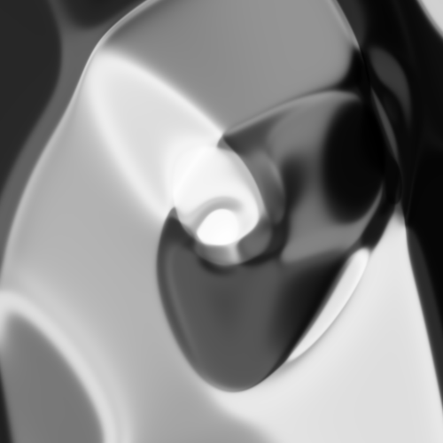
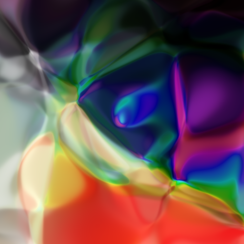

# CPPN in Keras 2

Implementation of a Compositional Pattern Producing Network in Keras 2 with some command-line utilities to easily generate your own images.

Code heavily borrowed from:
* https://github.com/hochthom/cppn-keras
* https://github.com/hardmaru/cppn-tensorflow


## Wallpapers

I've generated a bunch of patterns in high resolution (2560×1600) and made them available as [download](https://goo.gl/U9jBuh). Feel free to [tweet it out](https://twitter.com/intent/tweet?text=CPPN-Wallpapers%20by%20%40wottpal%20https%3A%2F%2Fgoo.gl%2FU9jBuh) if you like them.


## Other Examples

| | | |
|:-------------------------:|:-------------------------:|:-------------------------:|
||||


## Requirements
See `requirements.txt`. Install all of them via

```bash
pip3 install -r requirements.txt
````


## Usage

Execute the script with `-s` to save generated images to disk and/or with `-p` to display plots of them with *pyplot*. Additionally the following options are available:

* `--x` (int) [Default `500`] image-width
* `--y` (int) [Default `500`] image-height
* `--n` (int) [Default `1`] amount of images to be generated
* `--variance` (int) set this for a fixed variance of the initialized network-weights - Otherwise they will be generated randomly
* `--bw` set this flag to generate images in b&w
* `--path` (string) [Default `./results`] specifies the save-path for images

Example: Save 5 black & white wallpapers for a 13'' Retina screen.
```bash
python3 cppn.py -s --n 5 --x 2560 --y 1600 --bw
```


## Parameters to play with

If you want to change the look of your results, try to tune the following parameters:

* `--variance` and `--bw` script-parameters
* `kernel_initializer`, `depth` and `activation` of the CPPN in `build_model()`


## Todo

- [ ] Implement Video-Functionality
